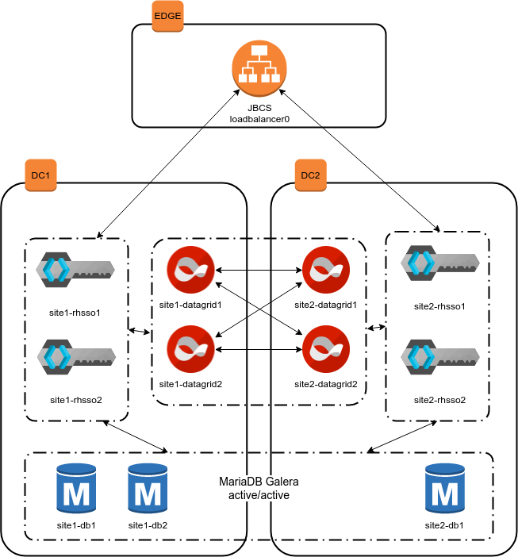

<h1 align="center"><a href="https://github.com/ansible-middleware/crossdc-rhsso-workshop/blob/main/instructions/01-environment-setup.md">Start here!</a></h1>

# Ansible-middleware workshop

Learn how to deploy a highly available Red Hat Single Sign-On service using Ansible and the ansible-middleware execution environment (maintained at https://ansible-middleware.github.io/).  

This workshop will deploy the following components:

* 4 x App Servers which will host [Red Hat Data Grid](https://access.redhat.com/products/red-hat-data-grid), 2 nodes x 2 clusters
* 4 x App Servers which will host [Red Hat Single Sign-On](https://access.redhat.com/products/red-hat-single-sign-on), 2 nodes x 2 clusters
* 1 x Frontend Server, which will host [Red Hat JBoss Core Services](https://access.redhat.com/collections/red-hat-jboss-core-services-collection) as reverse proxy and load balancer
* 3 x DB Servers, which will host [MariaDB](https://mariadb.org/) in a galera/wsrep cluster

The architecture is depicted below.

## Get Started

### Prerequisites

You will need an Red Hat network account to be able to download the DataGrid and Single Sign-On installation zip files.  The account you use must not be managed by SSO in order for the Ansible scripts to be able to authenticate.  You can create a new account by following the instructions in the [Red Hat Customer Portal](https://sso.redhat.com/auth/realms/redhat-external/login-actions/registration?client_id=customer-portal&tab_id=RiPOv96eZ74).  You will need to use these credentials when you run the ansible playbooks later in the workshop.

### Instructions

1. [Setup your environment](instructions/01-environment-setup.md)
2. [Learn about adding collections](instructions/02-adding-collections.md)
3. [Configure the database](instructions/03-configuring-the-database.md)
4. [Deploying Data Grid](instructions/04-deploying-datagrid.md)
5. [Deploying Single Sign-On](instructions/05-deploying-sso.md)
6. [Creating an authentication realm](instructions/06-create-sso-realm.md)
7. [Deploying the load balancer](instructions/07-deploying-jbcs.md)
8. [Scaling up](instructions/08-scaling-up.md)
9. [Testing](instructions/09-testing.md)
10. [Conclusion](instructions/10-conclusion.md)

